- **사전 수강 신청 (장바구니 기능)**
    - [X]  장바구니 기능을 활용하여 강의를 사전 신청할 수 있습니다.
        - [X]  사전 신청자가 강의의 정원을 넘지 않은 경우 강의 신청이 자동으로 이루어집니다.
        - [x]  사전 신청자가 강의의 정원을 넘은 경우 강의 신청이 이루어지지 않습니다.
    - [X]  사전 수강 신청이 이루어지지 않은 경우 찜 상태로 상태값을 변환합니다.
    - [X]  신청한 강의는 요일/시간이 겹치도록 신청할 수 없습니다.

1. 자신의 장바구니 조회
>  GET - http://localhost:8080/api/carts

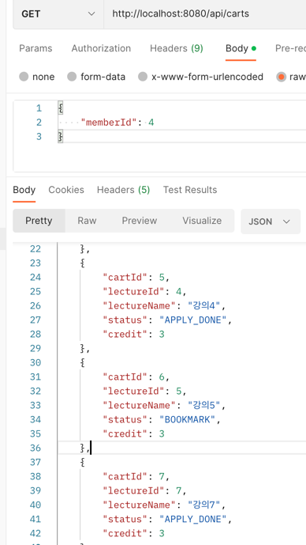

2. 수업 신청
> POST - http://localhost:8080/api/carts

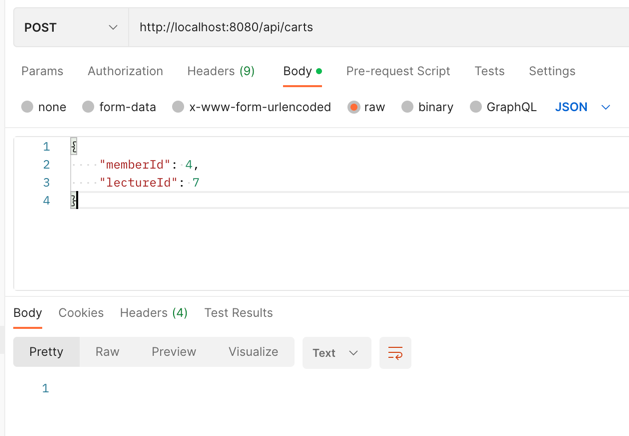

3. 수업시간이 겹치는 경우
> POST - http://localhost:8080/api/carts

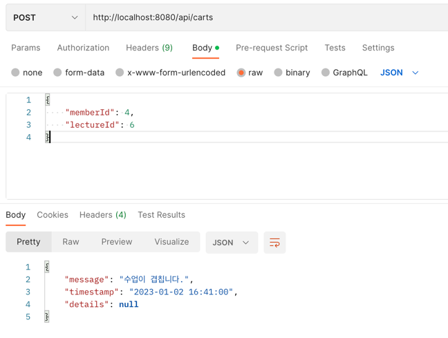

4. 정원 초과
> POST - http://localhost:8080/api/carts

lecture 5번의 경우 이미 정원이 다 차있어서, 조회시 BOOKMARK로 저장되어있음을 볼 수 있습니다.
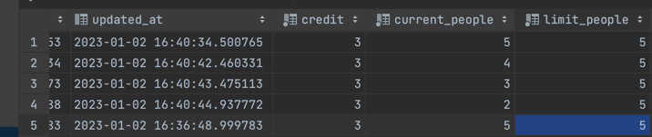

5. 학점 초과

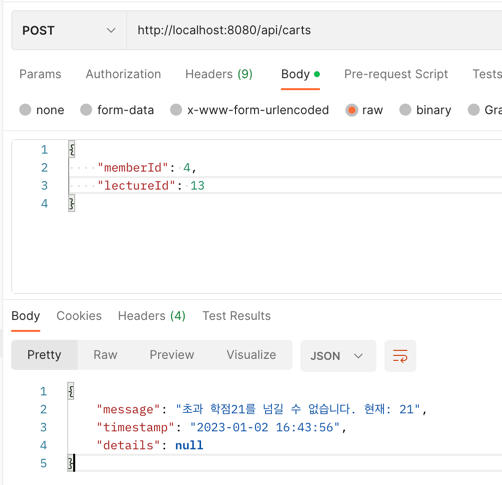

6. 자리가 나서 다시 진행
> http://localhost:8080/api/carts/re-apply

정원이 자리가 나면 /re-apply를 통해 재신청을 할 수 있습니다.
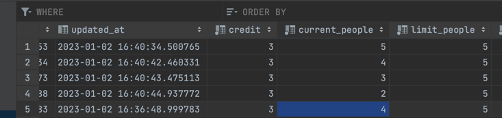
문제 없으면 빈값 반환
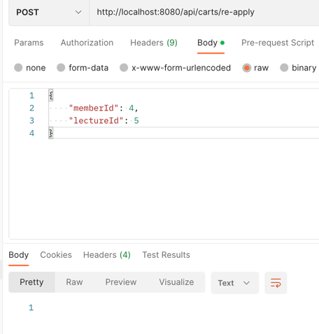
정원 초과면 예외 표시
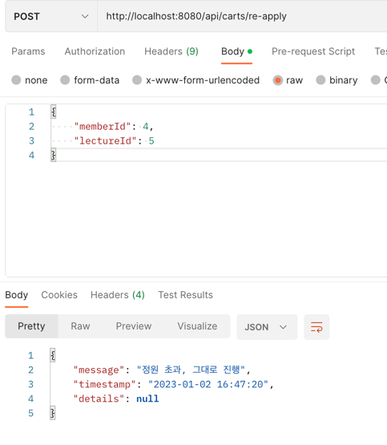

- **본 수강 신청**
    - [X]  회원은 최대 21학점까지 강의를 신청할 수 있습니다.
    - [X]  강의 신청 기간에 정원이내의 인원은 선착순으로 신청이 가능합니다.
    - [X]  신청한 강의는 요일/시간이 겹치도록 신청할 수 없습니다. (장바구니로 기 신청된 강의가 있을 경우 모두 포함)

1. 수강 신청
> POST - http://localhost:8080/api/lectures

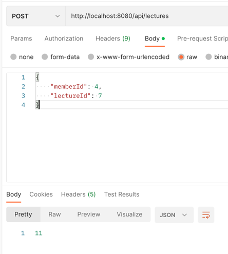

2. 시간 겹치는 경우
> POST - http://localhost:8080/api/lectures

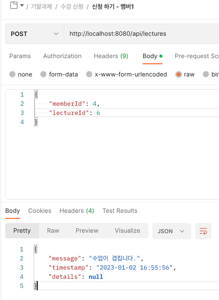
   
3. 정원 초과 경우

정원 초과의 경우 BOOKMARK로 저장됨
> POST - http://localhost:8080/api/lectures

5. 학점 초과
> POST - http://localhost:8080/api/lectures

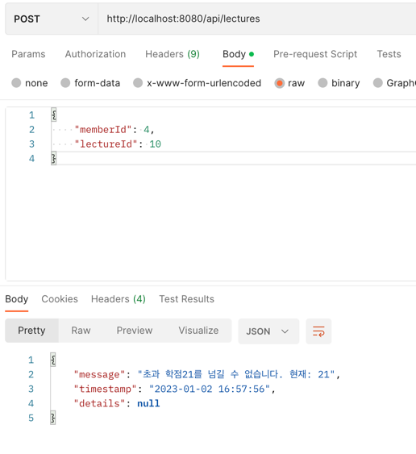

- **수강 신청 상태 관리**
    - [x]  강의 신청의 상태는 장바구니, 신청완료, 찜 총 3가지 상태로 관리합니다.
    - [x]  수강 신청에 실패하거나 취소할 경우 별도의 데이터를 생성 및 저장하지 않고 삭제합니다.

1. 수강 신청 조회

장바구니에 담긴 것들이 옮겨지면 CART, 본 수강신청에서 한 것은 DONE,
정원초과인 것은 BOOKMARK로 표시
> GET - http://localhost:8080/api/lectures/me

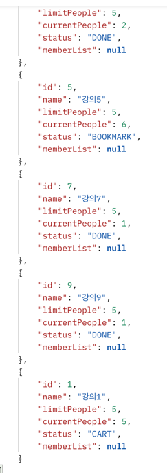

2. 수강 취소

> DELETE - http://localhost:8080/api/lectures

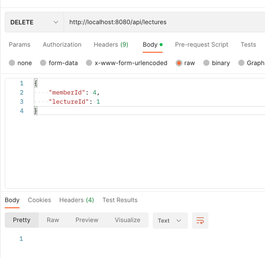

- 교수자
    - [x]  교수자가 담당하고 있는 강의의 신청 현황을 조회할 수 있습니다.

1. 교수는 자신의 강의 현황과 신청한 학생을 볼 수 잇습니다.

> GET - http://localhost:8080/api/professors/11

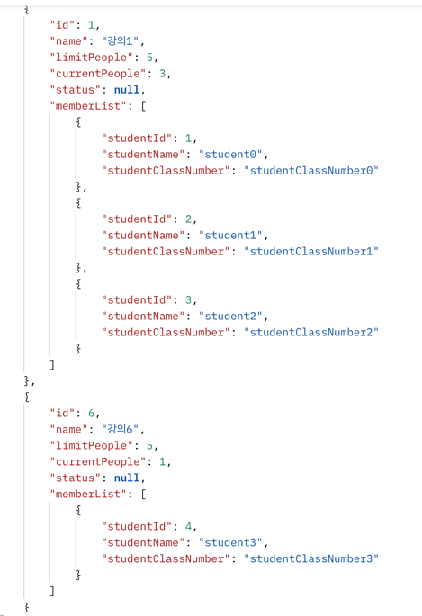

- 관리자 (부가 기능)

1. 장바구니에 있는 목록들 다 자동 수강 해주기, 아래 항목을 위해 추가
> 강의 장바구니 기간은 2023년 1월 9일 오후 2시부터 1월 10일 오후 6시까지이며, 강의 신청 가능 기간은 2023년 1월 11일 오후 2시부터 오후 6시까지로 설정합니다.
> http://localhost:8080/api/admin/move-cart-to-timetable 

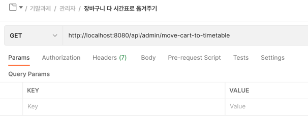